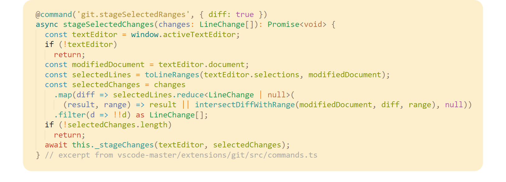
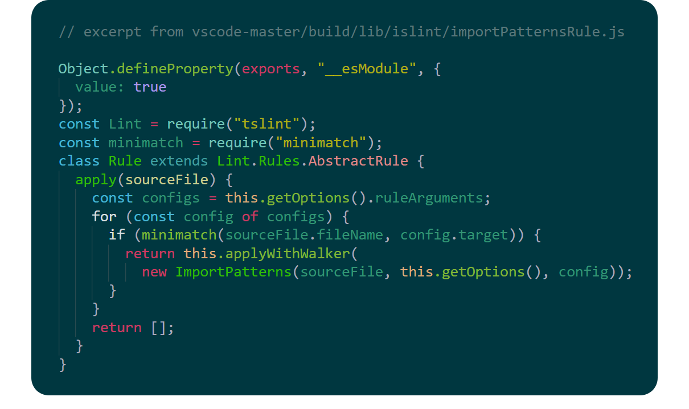

### 1 light theme + 1 dark theme. Not too bright, not too dark. Perfect for your eyes.

## Theme "Sepia":

## Theme "Sepia from Cuttlefish":

## To request a color improvement:
If you want to suggest how a piece of code should be highlighted, [submit an issue](https://github.com/ZYinMD/sepia/issues) and I'll make the change.

## To contribute:
If you'd like to contribute, [follow the instructions](https://github.com/ZYinMD/sepia/blob/master/CONTRIBUTING.md) and it'll be super streamlined and super easy.
